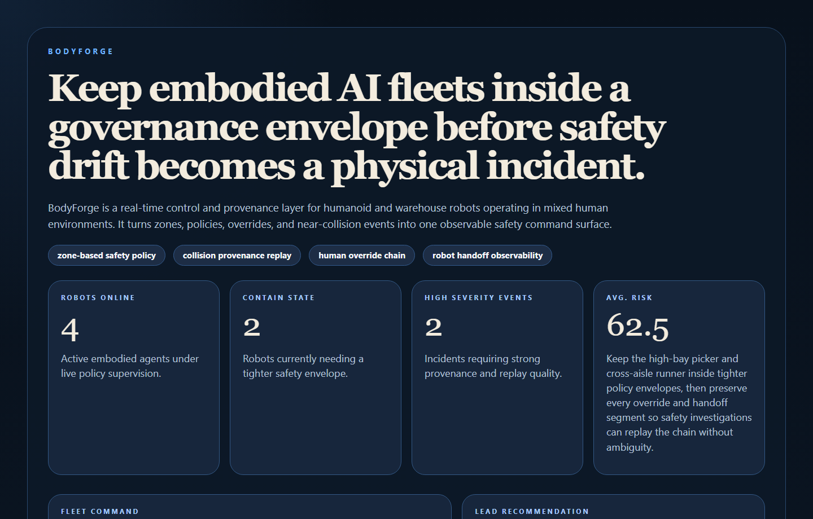
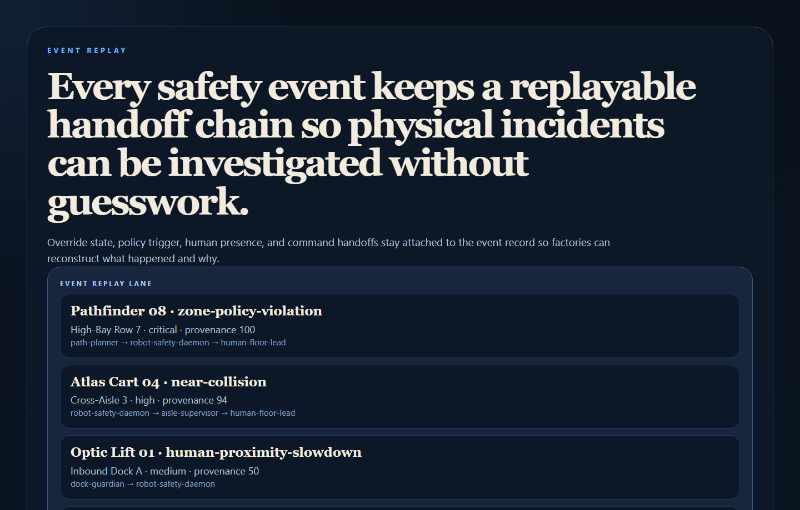
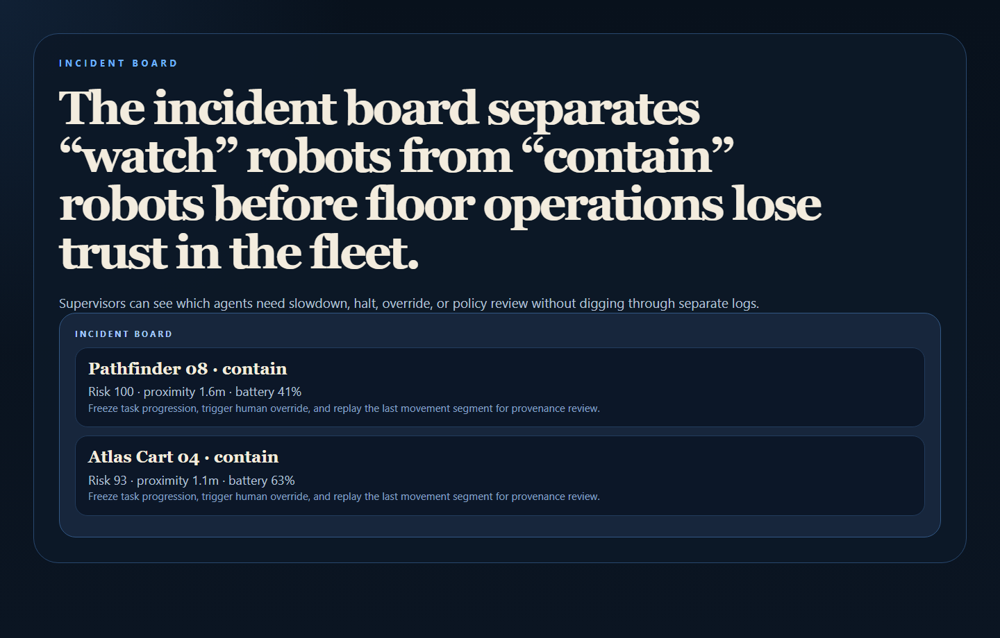
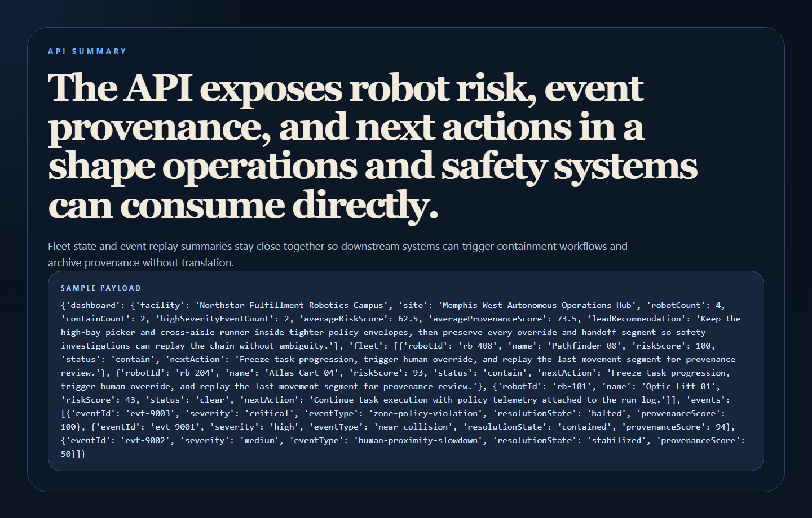

# BodyForge

Real-time governance and safety control plane for **embodied AI fleets** operating in warehouses, factories, and mixed human-robot environments.

> **What this repo proves**
>
> The real software opportunity in embodied AI is not just autonomy. It is the control layer that makes autonomy governable, replayable, and safe to operate around humans.



## Why this repo is good

- It tackles a real future enterprise problem: physical-agent safety, provenance, and override governance.
- It keeps the story commercially legible with zones, collisions, overrides, and incident replay.
- It gives you a flagship AI/ops/safety repo that feels more original than another software-only control plane.

## What it does

- Scores embodied robots for operational risk based on human proximity, task context, override readiness, battery state, and event history.
- Tracks safety events with policy triggers, handoff chains, and provenance scores.
- Separates clear, watch, and contain states for floor operations.
- Exposes a clean API plus operator-facing proof surfaces for fleet command, event replay, and incident review.

## Proof





## Local run

```powershell
Set-Location "C:\Users\chaus\dev\repos\bodyforge"
py -3.11 -m venv .venv
.\.venv\Scripts\pip.exe install -r requirements.txt
.\.venv\Scripts\python.exe -m app.main
```

Open:

- `http://127.0.0.1:4829/`
- `http://127.0.0.1:4829/event-replay`
- `http://127.0.0.1:4829/incident-board`
- `http://127.0.0.1:4829/docs`

## Validation

```powershell
.\.venv\Scripts\python.exe -m unittest discover -s tests
.\.venv\Scripts\python.exe scripts\run_demo.py
.\.venv\Scripts\python.exe scripts\smoke_check.py
.\.venv\Scripts\python.exe scripts\render_readme_assets.py
```

## API shape

Endpoints:

- `/api/dashboard/summary`
- `/api/robots`
- `/api/events`
- `/api/robots/{robot_id}`
- `/api/events/{event_id}`
- `/api/sample`

## Repo layout

```text
app/
  data/
  services/
docs/
scripts/
screenshots/
tests/
```
